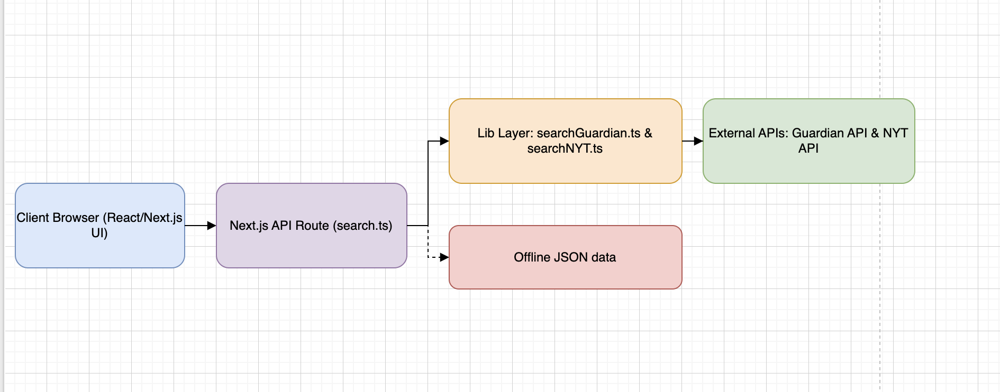

## Technologies used in this project

### Frontend
| What                    | Where                                        | Purpose                                                                 |
| ----------------------- | -------------------------------------------- | ----------------------------------------------------------------------- |
| **Next.js**             | Whole project (`pages/`, `components/`)      | React framework combining frontend UI with backend serverless functions |
| **React**               | All `.tsx` files in `pages/` & `components/` | Build reusable UI components, render search, articles, pagination       |
| **Tailwind CSS**        | Throughout components & pages                | Utility-first CSS for fast, responsive styling                          |


### Backend
| What                                | Where                                     | Purpose                                                          |
| ----------------------------------- | ----------------------------------------- | ---------------------------------------------------------------- |
| **Node.js**                         | `pages/api/search.ts`                     | API handler (serverless function) that processes search requests |
| **External API integrations**       | `lib/guardian.ts`, `lib/nyt.ts`           | Fetch data from Guardian & NYT                                   |
| **dotenv**                          | `.env.local`                              | Store API keys and config securely, loaded at runtime            |
| **Input validation & sanitization** | `pages/api/search.ts`                     | Validate keyword, page number, sanitize input                    |
| **Offline mode & caching**          | `public/offline.json` + `loadOfflineData` | Use fallback data when external APIs fail                        |


### Testing
| What             | Where         | Purpose                                               |
| ---------------- | ------------- | ----------------------------------------------------- |
| **Vitest**       | `tests/`      | Unit & integration tests                              |
| **Mock Service** | `createMocks` | Simulate HTTP requests/responses to test API handlers |


### Build, CI/CD & Deployment
| What                  | Where                                 | Purpose                                                  |
| --------------------- | ------------------------------------- | -------------------------------------------------------- |
| **GitHub Actions**    | `.github/workflows/*.yml`             | Automate test, build & Docker push on commit             |
| **Docker**            | `Dockerfile`                          | Build production-ready container image                   |
| **Docker Hub**        | `sreedockerhub19/news-search-service` | Store Docker image for deployment                        |
| **Vercel**            | Deploy frontend+backend automatically | Next.js serverless hosting (alternative to self-hosting) |


### Other Dev / Quality Tools
| What                                   | Purpose                                                                                 |
| -------------------------------------- | --------------------------------------------------------------------------------------- |
| **12-Factor App principles**           | Config in env vars, separate build/run stages, treat logs as event streams, etc.        |
| **SOLID principles & design patterns** | Code organization, single responsibility, open/closed principle, separation of concerns |
| **Swagger / OpenAPI**                  | `openapi.yaml` to document the API contract and endpoints                               |


<hr>

## Getting Started

- First, run the development server:

```bash
npm install
npm install -D tailwindcss postcss autoprefixer
npm install -D @tailwindcss/postcss 
npm install --save-dev jest supertest @types/jest ts-jest
npm install -D vitest @types/node node-mocks-http
npm install dotenv --save-dev

## For dev run
npm run dev
## For production build
npm run build && npm run start
## For testing
npx vitest run --coverage
## For Swagger
npm install -D redoc
## For docker
docker build -t my-next-app .
docker run -p 8080:8080 --env-file .env.local my-next-app


```


Open [http://localhost:8080](http://localhost:8080) with your browser to see the result.

To check the API response:
- http://localhost:8080/api/search?keyword=apple
- https://nextjsnewssearchmicroservices.vercel.app/api/search?keyword=apple
- https://nextjsnewssearchmicroservices.vercel.app/api/search?keyword=apple&city=New%20York&page=1

To check Swagger / OpenAPI docs:
- http://localhost:8080/docs.html
- https://nextjsnewssearchmicroservices.vercel.app/docs.html

You can start editing the page by modifying `app/page.tsx`. The page auto-updates as you edit the file.

This project uses [`next/font`](https://nextjs.org/docs/app/building-your-application/optimizing/fonts) to automatically optimize and load [Geist](https://vercel.com/font), a new font family for Vercel.

## Deploy on Vercel

- Push the code changes to github
- The easiest way to deploy your Next.js app is to use the [Vercel Platform](https://vercel.com/new?utm_medium=default-template&filter=next.js&utm_source=create-next-app&utm_campaign=create-next-app-readme) from the creators of Next.js.
- Integrate Github repo with Vercel
- API keys:
    - GUARDIAN_API_KEY= https://open-platform.theguardian.com/
    - NYT_API_KEY= https://developer.nytimes.com/my-apps/ffb4ca1d-72ed-455d-be46-057ad15d708f

<hr>
<hr>

## Requirements covered in the project


### Expected output 
Covered the below points:
- News Website
- List of URL’s of the articles
- List of description/headline from article
- Total no of pages
- Search Keyword
- City (if not specified in Search Query Param, it is taken as New York by default)
- Page no. retrieved
- Previous and Next Page No
- Time taken to perform the API call

<hr>

### NFRs 

#### Demonstrated SOLID, 12 Factor and HATEOAS principles, Design Patterns in the design and implementation

✅ 1️⃣ SOLID principles

- Single Responsibility	 :  Split searchGuardian and searchNYT into own files. Moved pagination logic into a helper.
- Open/Closed  :  Instead of hardcoding Guardian + NYT, used sources array, so adding new source doesn’t change handler logic.
- Liskov Substitution Principle : Kept same return shape in all source functions.
- Interface Segregation: Kept source functions returning consistent shape.
- Dependency Inversion: Used env vars and config, did not hardcode API keys or URLs.


✅ 2️⃣ 12-Factor App
- (3	Config) - Config kept in .env.local, never committed API keys, and stored them in secret variables in Vercel and Github Actions
- (2	Dependencies) - Dependencies: in package.json.
- (11	Logs) - Logs: used console.log / console.error.

✏ Summary Table:
<pre>
#	Factor	:Idea
1	Codebase	:One codebase, many deploys : A single codebase (e.g., Git repo) serves as the source for many deployments (dev, staging, production).
You don’t have multiple versions for each environment — the same code is deployed everywhere.
2	Dependencies	:Explicit, isolated : The app should declare all its dependencies (libraries, frameworks, etc.) in a dependency manifest (e.g., package.json, pom.xml, etc.) and not rely on system-installed packages.
Use dependency isolation (e.g., virtualenv, Docker, etc.).
3	Config	:In environment variables: Configuration (like database URLs, credentials, API keys) should be stored in environment variables, not in the codebase.
This keeps code portable and separates config from code.
4	Backing services	:Treat as attached resources: Databases, caches, message queues, etc., are "backing services" and should be treated the same way, whether local or third-party.
You can swap a service (like moving from local MySQL to AWS RDS) without code changes.
5	Build, release, run	:Separate stages 
Build: Compile code, assets, etc.

Release: Combine build with config to make a release.

Run: Execute the app (e.g., start the web server).

This separation ensures you deploy repeatable, predictable builds.
6	Processes	:Stateless, share nothing: Your app should run as one or more stateless processes (e.g., web workers, background jobs).
Any needed data should be stored in a backing service (e.g., database), not in memory or local files.
7	Port binding	:Self-contained, export via port : The app should be self-contained: it should expose HTTP (or another protocol) directly via a port (e.g., 8080), rather than relying on an external web server (like Apache) for serving.
8	Concurrency	:Scale out via processes : Scale the app by running multiple processes of the same type (e.g., multiple web or worker processes).
This allows you to horizontally scale easily.
9	Disposability	:Fast start/stop : App processes should start quickly and shut down gracefully to make scaling and deployment smooth and robust.
10	Dev/prod parity	:Keep environments similar: Same backing services

Similar tools and dependencies

Avoid "works on my machine" issues
11	Logs	:Treat as event streams: The app should not manage log files.
Instead, write logs to stdout/stderr; let the execution environment or a log collector handle storage and aggregation.
12	Admin processes	:Run as one-off processes: Tasks like migrations, console access, or data fixes should be run as one-off processes in the same environment and codebase.
</pre>


✅ 3️⃣ HATEOAS (Hypermedia as the Engine of Application State)
- In REST: returned links in JSON, to help client navigate.
<code>
{
  "guardian": [
    {
      "source": "Guardian",
      "title": "Offline Guardian News",
      "url": "https://example.com/guardian-offline",
      "description": "Offline description"
    }
  ],
  "nyt": [
    {
      "source": "NYT",
      "title": "Offline NYT News",
      "url": "https://example.com/nyt-offline",
      "description": "Offline snippet"
    }
  ]
}

</code>


#### Demonstrate Performance, Optimization & Security aspects

✅ 4️⃣ Performance, Optimization & Security
- Used pagination instead of loading all articles.
- Validated user inputs: trim, max length, whitelist.
- Hid env vars in deployment (Vercel → Project Settings → Environment Variables).
- Never logged sensitive data.


#### Demonstrate Production readiness of the code
✅ 5️⃣ Production readiness

- Stored the variables in Vercel config directly (not visible to users)
- Handled offline gracefully with toggling


#### Demonstrate TDD & BDD & Quality aspects
✅ 6️⃣ TDD, BDD & Quality

- Added test cases using Jest, and executed in CI/CD Github Actions pipeline


#### Demonstrate sensitive information used in the Micro Services such as API keys are protected / encrypted

✅ 7️⃣ Sensitive info encrypted

- Stored keys in .env.local (not committed).
- Added secrets in Vercel variables for vercel deployment
- Added secrets in Github repo for CI/CD pipeline

#### Design Patterns used in the code

-
✅ 1. Facade Pattern
You use a facade over multiple APIs:

// lib/searchSources.ts
<code>
export const searchSources = [
  { name: 'Guardian', fn: searchGuardian },
  { name: 'NYT', fn: searchNYT }
]
</code>
Explanation:

- Instead of calling each external API directly from the UI or route, we defined an abstraction (searchSources).
- The API route (/api/search) just loops over these sources — this hides complexity and creates a single entry point to multiple services.
- This is a classic facade: a single interface to a complex subsystem.

-
✅ 2. Strategy Pattern
searchGuardian and searchNYT implement the same interface:

<code>
export async function searchGuardian(keyword: string, page: number) { ... }
export async function searchNYT(keyword: string, page: number) { ... }
</code>
Explanation:

- The system selects at runtime which strategy (API) to call, and can easily add or replace sources.
- This follows strategy: different algorithms (APIs) implementing the same interface, selected dynamically.

-
✅ 3. Singleton / Configuration pattern
You centralize config and secrets in .env.local and access via process.env:

<code>
const apiKey = process.env.GUARDIAN_API_KEY
</code>

While not a strict singleton class, this ensures there is only one place where these settings live.

-
✅ 4. Template Method Pattern (partial)
- Both searchGuardian and searchNYT:
    - Build a URL
    - Fetch data

- We actually mapped response to unified shape

- If we extract common logic to a base function (e.g., searchGeneric), it becomes a clearer template method.

-
✅ 5. HATEOAS & REST principles

In /api/search:
<code>
_links: {
  self, prev, next
}
</code>

We are following RESTful API design + HATEOAS (Hypermedia as the Engine of Application State).
This adds navigational affordances in the response, making the client discover next actions dynamically.

<hr>


### Sequence diagram or flowchart created using draw.io – https://www.draw.io




### Build & Deploy 

#### CI
- Used Github Actions Workflow for automatic job trigger on code push

#### CD
- Project built and deployed to docker upon Github Actions successful execution
- Also deployed to Render: 
    - https://news-search-service.onrender.com/
    - https://dashboard.render.com/web/srv-d1r5n10dl3ps73f3mo2g
    - To suspend / resume the app : https://dashboard.render.com/web/srv-d1r5n10dl3ps73f3mo2g/settings

<hr>
